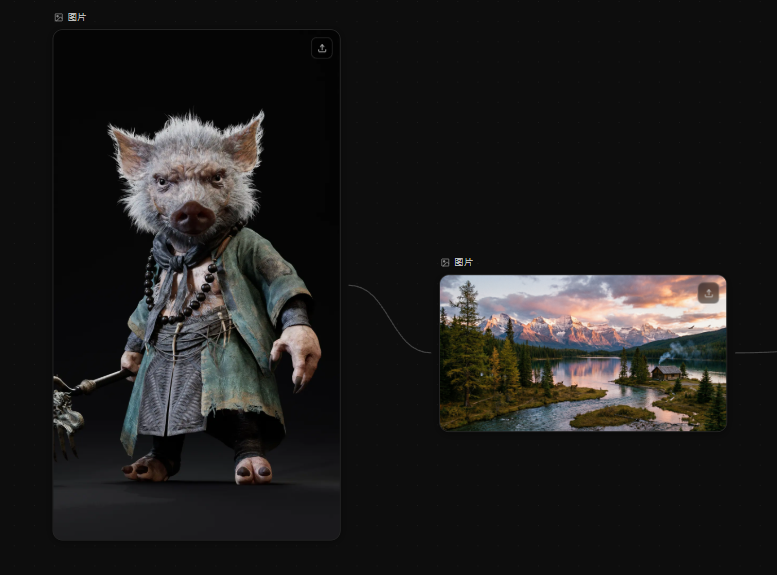
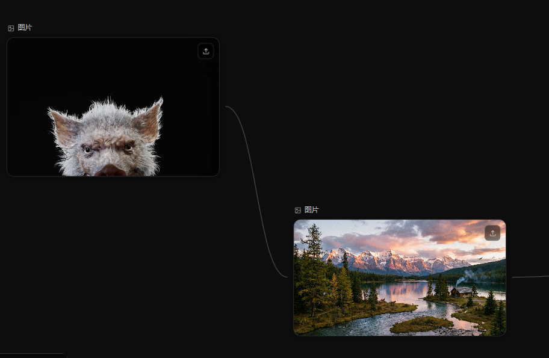
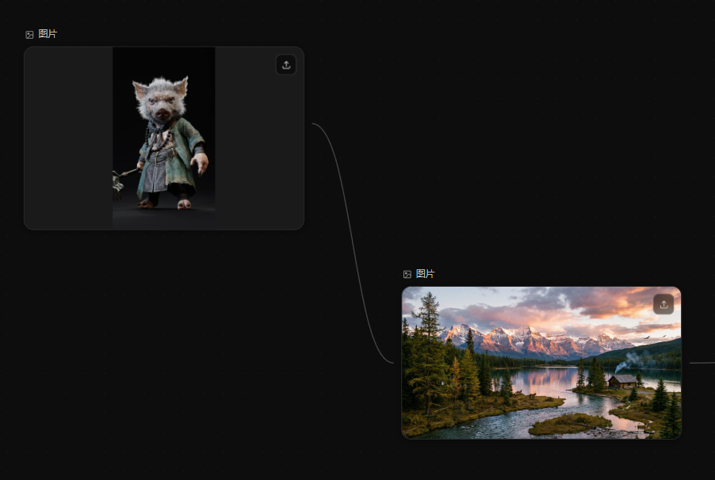
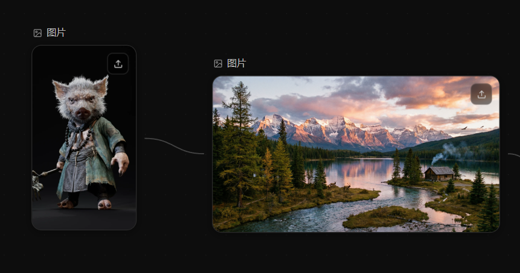

# ImageNode 功能迭代与尺寸自适应

**日期：** 2026-04-10

---

## 区分上传型 / 生成型节点

- 新增 `imageSource: 'uploaded' | 'generated'` 字段到 `NodeData` 与 `ImageNodeData`
- 上传图片时标记 `imageSource: 'uploaded'`，此类节点不渲染提示词面板（`CollapsibleSection` 整体隐藏）
- 生成型节点选中时展开 `ImagePromptPanel`，取消选中时平滑收折

## 提示词持久化

- 新增 `imagePrompt` 字段，生成成功后将使用的提示词写入节点数据
- 节点初始化时从 `data.imagePrompt` 恢复提示词（`useState` lazy init + `useEffect` 同步）
- 生成完成后不清空输入框，用户可直观看到上次用过的提示词

## 参考图功能

生成型节点连线接入另一个图片节点时，自动在提示词面板中显示参考图缩略图。

**实现细节：**
- 读取 `projectStore` 的 `edges` / `nodes`，找到所有连入本节点的源节点
- 源节点的 `imageUrl` 经 `resolveImageUrl` 解析为 blob URL，存入 `refImages` 状态
- 新增 `RefImageThumbnails` 组件：36×36 缩略图 + 蓝色数字角标，嵌入 `ImagePromptPanel` 风格按钮旁
- 连线断开时自动清空缩略图并 revoke blob URL，无内存泄漏

## 节点尺寸自适应图片

### 问题迭代过程

**v1 — `objectFit: cover` + 固定高度上限**

图片被裁切，仅显示头部，丢失主体内容。

**v2 — `width: auto; max-height: 260px; margin: 0 auto`**

保持纵横比、无裁切，但竖图宽度小于节点宽度，两侧出现黑边空白。

**v3（最终）— 节点容器宽度跟随图片**

`handleImgLoad` 根据图片自然比例计算 `imgRenderedW` / `imgRenderedH`，上限 400×260：
- 横图：宽铺满 400，高按比例（超 260 则反推宽）
- 竖图：以 260 限高算宽（超 400 则反推高）

节点容器 `width` 跟随 `imgRenderedW`，图片 `width: 100%`，无空白黑边，Handle 位置始终居中于实际渲染图片区域。

## 涉及文件

| 文件 | 改动 |
|------|------|
| `src/types/index.ts` | `NodeData` 新增 `imageSource`、`imagePrompt` 字段 |
| `src/components/nodes/ImageNode.tsx` | 全部功能实现 |
