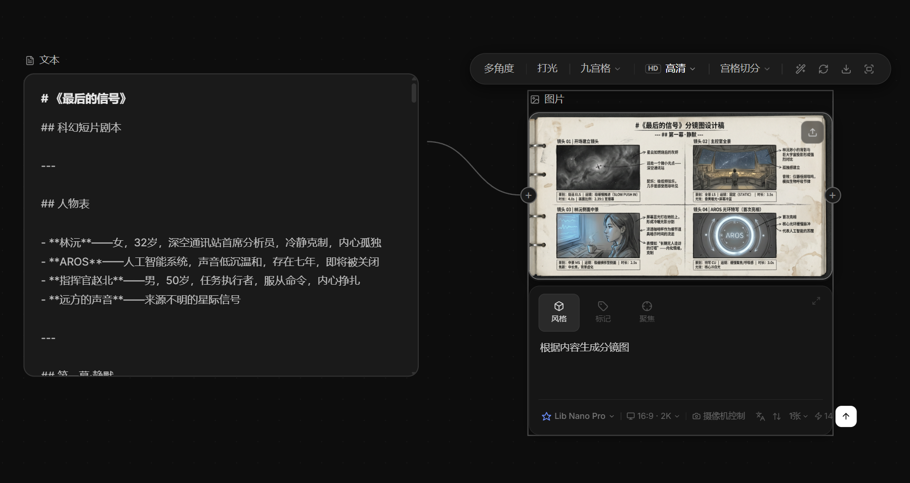

# 2026-04-16_01 AI 节点上下游数据传递修复

## 问题背景

用户反馈两个核心 AI 工作流功能失效：

1. **ScriptNode 无法识别上游 ImageNode 的图片** —— AI 回复"您提到了根据图片，但我没有收到任何图片附件"
2. **ImageNode 无法利用上游 ScriptNode 的文字内容生成图片** —— 生成结果是一张"操作说明卡"而非真实画面

---

## Bug 1：ScriptNode 图片传递失效

### 根本原因

`imageStore.ts` 中的 `resolveImageToDataUrl()` 函数对 `/uploads/images/xxx.png` 这类本地服务器路径的处理有误。

旧代码逻辑：
```
if (!isIdbRef(ref)) return ref   // 直接返回原始路径
```

这导致 `/uploads/...` 相对路径被原样发送给 Anthropic API。  
Anthropic 的云端服务器无法访问用户本机的 `localhost`，图片实际上从未被 AI 看到。

### 修复方案

在 `resolveImageToDataUrl` 中新增 `/` 开头路径的处理分支：
- 用浏览器 `fetch` 在本地下载图片 blob
- 通过 `FileReader.readAsDataURL()` 转换为 base64 data URL
- 将 base64 字符串嵌入 API 请求，Anthropic 即可正确接收

同时修复 `default://placeholder` 占位图被误发给 AI 的问题（改为直接返回 `null` 跳过）。

---

## Bug 2：ImageNode 文字上下游传递失效

### 根本原因

`ImageNode.tsx` 的 `handleGenerate` 将原始中文剧本文本直接拼接进 LightAI 的提示词：

```typescript
// 旧代码
const finalPrompt = sourceTextContent
  ? `参考内容：\n${sourceTextContent}\n\n画面描述：${userPrompt}`
  : userPrompt
await lightaiGenerateImage(finalPrompt, ctrl.signal)
```

LightAI 是图像生成模型，不理解剧本格式，导致生成出一张解释"如何使用"的手绘说明卡图片。

### 修复方案

将生成流程改为两步：

**Step 1 — 文字 AI 转换提示词**

当检测到上游 ScriptNode 有文字内容时，先调用 `streamAI`，使用专门的 system prompt 将剧本内容 + 用户指令转换为英文绘图 prompt：

```
你是专业的AI绘图提示词工程师。根据提供的剧本内容和用户指令，生成一段简洁、
适合AI图像生成的英文提示词（prompt）。只输出prompt本身，不要有任何解释、
标题或前缀。prompt要包含画面构图、人物外貌、场景氛围、光线风格等视觉元素。
```

**Step 2 — 用 AI 生成的 prompt 调用 LightAI**

将 Step 1 输出的英文视觉描述传给 `lightaiGenerateImage`，生成真实画面。

如果 Step 1 失败，自动降级使用用户原始 prompt，不阻断生成流程。

同时在 `streamAI()` 函数签名中新增 `systemOverride` 参数，支持调用方传入自定义 system prompt，覆盖默认的 contextType 预设。

---

## 效果

ScriptNode（剧本《最后的信号》）→ ImageNode 生成分镜画面，AI 正确理解剧本中的科幻场景、人物设定，输出包含镜头描述和画面说明的分镜图设计稿。



---

## 改动文件

| 文件 | 改动内容 |
|---|---|
| `frontend/src/stores/imageStore.ts` | `resolveImageToDataUrl`：`/` 路径 fetch → base64；`default://` 返回 null |
| `frontend/src/api/index.ts` | `streamAI` 新增 `systemOverride` 参数，透传至后端 `system_override` 字段及直连路径 |
| `frontend/src/components/nodes/ImageNode.tsx` | `handleGenerate`：上游文本存在时先用 AI 转换为绘图 prompt 再调用 LightAI |
