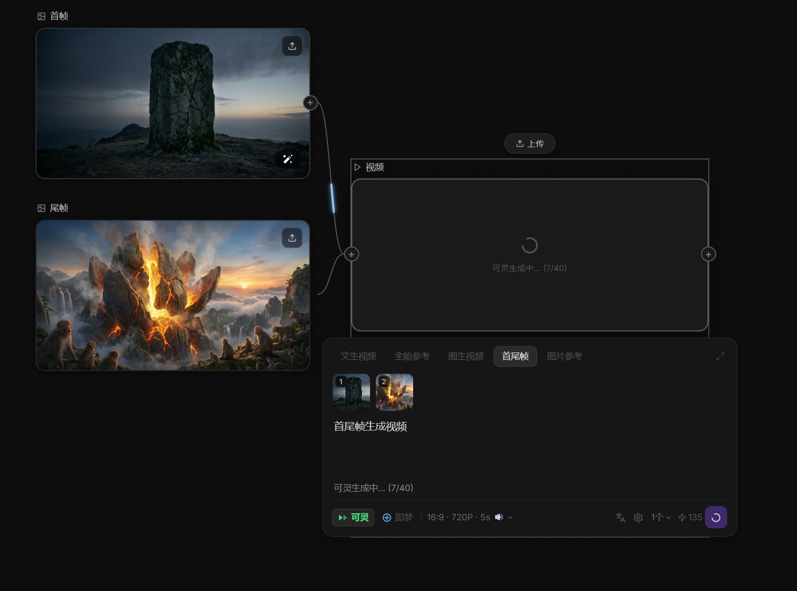

# 2026-04-17 VideoNode 视频播放与后台服务修复

## 1. VideoNode 接入 LightAI 统一视频生成接口

### 背景
原来可灵和即梦分别走独立的直连 API（可灵需要 JWT 鉴权，即梦走 ARK API），配置复杂，密钥多。改为通过 LightAI 统一异步任务接口调用，复用同一个 LightAI API Key。

### 接口流程
```
1. POST /api/lightai/create_async_task   → 获得 task_id
2. GET  /api/lightai/get_task_status/{task_id}  每 15s 轮询
3. status === 2 → 从响应中提取视频 URL
```

### 可灵请求体（文生视频）
```json
{
  "service_name": "keling",
  "api_name": "text_to_video",
  "app_info": { "model": "kling-v3", "mode": "pro" },
  "task_query": {
    "json": { "prompt": "...", "model_name": "kling-v3", "duration": 5, "aspect_ratio": "16:9", "mode": "pro", "sound": "off" }
  }
}
```

### 即梦请求体
```json
{
  "service_name": "volces_ark",
  "api_name": "video30_generate",
  "app_info": { "model": "doubao-seedance-1-5-pro-251215", "mode": "" },
  "task_query": {
    "json": {
      "model": "doubao-seedance-1-5-pro-251215",
      "ratio": "adaptive", "duration": 5, "resolution": "720p",
      "generate_audio": false, "watermark": false,
      "content": [{ "type": "text", "text": "..." }]
    }
  }
}
```

### 效果截图

首尾帧图生视频，可灵生成中（7/40 轮询）：



### 图生视频：先上传 COS
可灵/即梦图生视频只接受 COS URL，不接受 base64。上游图片先上传：
```
POST /api/lightai/upload_cos (multipart/form-data)
  image_file = <blob>
  cos_path   = skill_api/user_upload/{timestamp}_frame.png
→ 返回 download_url
```

### 改动文件
| 文件 | 改动 |
|---|---|
| `frontend/src/api/index.ts` | 删除直连可灵/即梦旧实现；新增 `_lightaiUploadImageForVideo()`、`_lightaiExtractVideoUrl()`、`_lightaiExtractTaskId()`、`_lightaiPollVideoTask()`；重写 `klingGenerateVideo()` 和 `jimengGenerateVideo()` |
| `frontend/src/stores/settingsStore.ts` | 删除 `kling`/`jimeng` 独立服务配置 |
| `frontend/vite.config.ts` | 删除 `/api/kling`、`/api/jimeng` 代理 |

---

## 2. VideoNode 视频播放修复

### 问题
视频生成成功后，节点显示的是静态图（第一帧），无法播放。

### 原因
`<video>` 标签设置了 `controls={false}`，没有播放控件，且没有 autoPlay，浏览器不会自动播放。

### 修复
```tsx
// 修复前
<video src={data.videoUrl} controls={false} />

// 修复后
<video
  src={data.videoUrl}
  controls
  autoPlay
  loop
  muted
  playsInline
/>
```

- `controls`：显示播放控件（进度条、音量、全屏）
- `autoPlay` + `muted`：节点加载后自动静音循环播放（浏览器要求静音才能自动播放）
- `loop`：循环播放
- `playsInline`：移动端不全屏播放

---

## 3. 后台服务启动问题修复

### 问题
登录报 404，CORS 报错。

### 根本原因一：端口冲突
存在两个 Python 进程同时监听同一端口（8000/8001），一个是正确的 uvicorn 实例，另一个是残留的旧 `python main.py` 进程（没有任何路由注册），导致大部分请求被旧进程拦截返回 404。

**处理方式**：启动前先 `Stop-Process` 清理所有 python 进程，再从正确目录 `backend/` 启动 uvicorn。

### 根本原因二：前端直接请求后端 URL（CORS）
`VITE_API_URL=http://localhost:8001` 被直接拼入 axios `baseURL`，导致请求从浏览器直接发往 8001 端口，绕过 Vite 代理，触发 CORS。

**修复**：
```typescript
// 修复前
const API_BASE = import.meta.env.VITE_API_URL || ''
export const apiClient = axios.create({ baseURL: `${API_BASE}/api/v1` })

// 修复后（走 Vite 代理 /api → localhost:8001）
export const apiClient = axios.create({ baseURL: '/api/v1' })
```

`VITE_API_URL` 只用于 `vite.config.ts` 里的代理 target，不暴露给前端 JS。

### 服务端口
| 服务 | 端口 |
|---|---|
| FastAPI 后端 | 8001 |
| Vite 前端 | 3000（被占用时自动+1） |
