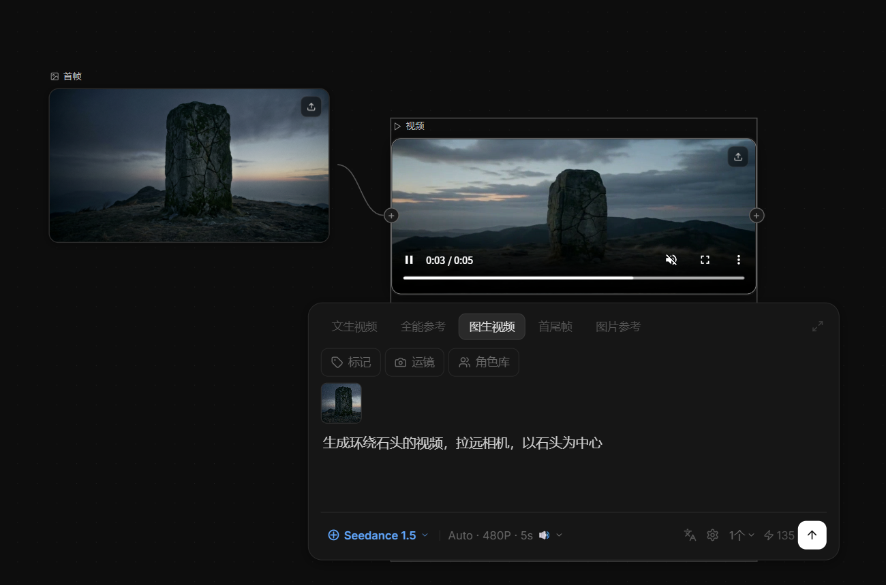

# 2026-04-17 VideoNode 模型选择菜单与参数面板

## 1. 模型选择改为下拉菜单

### 背景
原来底部工具栏有两个并列的切换按钮（可灵 / 即梦），不够直观，且扩展性差，无法承载更多模型信息。

### 改动
将两个 inline toggle 按钮替换为单个下拉触发器 + 向上弹出菜单。

**触发器：**
- 显示当前选中模型的图标 + 名称 + 向下箭头
- 点击展开/收起，与参数面板互斥（打开一个时自动关闭另一个）

**下拉菜单每行：**
- 左侧：带彩色边框图标方块（选中时用模型主色）
- 中间：模型名称（粗体）+ 平台副标题 + 描述文字
- 右侧：选中状态圆点

**当前模型列表：**
| ID | 显示名 | 平台 | 颜色 |
|---|---|---|---|
| `jimeng` | Seedance 1.5 | 即梦 | `#60a5fa` |
| `kling`  | Kling 3.0    | 可灵 | `#4ade80` |

### 改动文件
| 文件 | 改动 |
|---|---|
| `frontend/src/components/nodes/VideoNode.tsx` | 新增 `ModelOption` interface；扩展 `MODEL_OPTIONS`；新增 `modelOpen` 状态与 click-outside 监听；底部工具栏替换为下拉触发器 + 弹出菜单 |

---

## 2. 视频生成参数设置面板

底部工具栏新增参数按钮，点击向上弹出参数设置面板，内容根据模型不同自动适配：

| 参数 | 可灵 | 即梦 |
|---|---|---|
| 比例 | 16:9 / 9:16 / 1:1 可选 | 固定 Auto |
| 清晰度 | 固定 720P | 480P / 720P / 1080P 可选 |
| 视频时长 | 5s / 10s 滑块 | 5s / 10s 滑块 |
| 生成音频 | 🔊 开启 / 🔇 关闭 | 🔊 开启 / 🔇 关闭 |

参数按钮实时显示当前值，如：`Auto · 480P · 5s 🔇`

---

## 3. 图生视频效果

首帧图片连接到视频节点，选择「图生视频」标签，引用图片缩略图显示在提示词面板中，生成后视频自动播放。

提示词：`生成环绕石头的视频，拉远相机，以石头为中心`  
模型：Seedance 1.5（即梦）· Auto · 480P · 5s

---

## 4. 引用图片显示修复

上游图片节点通过 `+` 连线后，在提示词面板的图标按钮行下方新增缩略图展示区：
- 从 ReactFlow edges 中找到所有上游 `libtv_image` 节点
- `idb://` 格式的 URL 异步 resolve 为可显示 URL
- 40×40 圆角缩略图，支持多张并排

### 改动文件
| 文件 | 改动 |
|---|---|
| `frontend/src/components/nodes/VideoNode.tsx` | 新增 `resolvedRefUrls` state + `useEffect` resolve；`refImageUrls` prop 传入 `VideoPromptPanel`；面板内渲染缩略图 |
