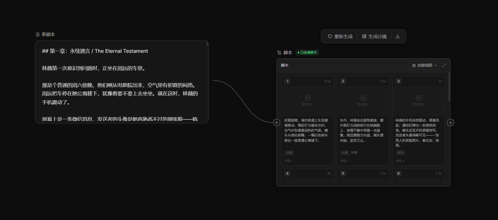

# 2026-04-21_04 ScriptGenNode 分镜脚本生成修复

## 背景

分镜脚本节点（`ScriptGenNode`）在 AI 生成内容后，始终展示「红岸基地：第一声啼鸣」的
模拟数据，未能填充真实 AI 结果。经过多轮排查共发现并修复了以下问题。

---

## 问题一：React StrictMode 导致 state updater 副作用双调用

**根因**：`onDone` 回调把 `parseShots`、`setShots`、`addLog` 等副作用全部写在
`setStream(prev => { ... })` 这个 state updater 函数内部。React StrictMode
在开发模式下会故意把 state updater **调用两次**来检测副作用：
- 第一次调用时 `prev = ''`，`parseShots('')` 返回 null，立即触发 `setShots(MOCK_SHOTS)`
- 第二次虽有真实数据，但 MOCK_SHOTS 已排入队列，日志里因此出现**两条** WARN

**修复**：新增 `streamRef = useRef<string>('')`，在 `onChunk` 里同步写入：
```ts
streamRef.current += c
```
`onDone` 改为直接读 `streamRef.current`，彻底脱离 state updater，不受 StrictMode 影响。

---

## 问题二：sceneTitle 初始值为 MOCK 数据且成功时从未更新

**根因**：
```ts
// 初始值就是 mock 标题
const [sceneTitle, setSceneTitle] = useState(MOCK_SCENE_TITLE)

// onDone 成功分支只调了 setShots / setText，从未调 setSceneTitle
setShots(parsed)
setText(raw)
// ← setSceneTitle 缺失！
```

**修复**：
- 初始值改为空字符串：`useState('')`
- 解析成功后补充：`setSceneTitle(nodeLabel)`

---

## 问题三：parseShots 贪婪正则被 JSON 字符串内容中断

**根因**：旧正则 `/\[[\s\S]*\]/` 是贪婪的，如果 AI 输出的 description 字段中含有
方括号（如 `[妈妈: 中年女性…]`），匹配结果会从第一个 `[` 跑到字符串内容里最后一个 `]`，
截出半截 JSON，`JSON.parse` 报错。

**修复**：改为平衡括号计数法，精确找到第一个顶层 `[…]` 块。

---

## 问题四：AI 在 JSON 字符串值中输出未转义双引号

**根因**：AI 生成的 description 内容包含对话引号，例如：
```
"description": "消息内容："今晚的电影好看吗？""
```
内部 `"` 未转义为 `\"`，JSON 在该位置断裂，`JSON.parse` 失败。

**修复**：新增多级容错解析策略：
1. 直接 `JSON.parse`（正常情况）
2. 去除尾随逗号后再 `JSON.parse`
3. `parseShotsLenient`：完全不依赖 JSON 结构，通过 `"sequence": N` 定位每个镜头，
   再用 `readStringValue` 状态机逐字符提取各字段值，免疫所有 JSON 语法错误
4. 失败时日志记录每层具体错误原因，便于后续排查

---

## 问题五：内容区高度无限增长

**根因**：table/grid 直接渲染在卡片内，无高度限制，14 个镜头时节点撑到屏幕高度。

**修复**：在 table/grid 外包一层固定高度滚动容器：
```tsx
<div className="nodrag nopan nowheel" style={{ height: 340, overflowY: 'auto' }}>
  {viewMode === 'script' ? <StoryboardTable ... /> : <CreativeGrid ... />}
</div>
```
`nowheel` 防止在卡片内滚动时意外触发画布缩放。

---

## 效果



剧本节点内容成功解析为 14 个分镜卡片，创意视图正常展示，节点高度固定可滚动。

---

## 涉及文件

| 文件 | 变更类型 |
|------|---------|
| `frontend/src/components/nodes/ScriptGenNode.tsx` | fix: 分镜解析、StrictMode副作用、高度限制 |
| `backend/app/api/v1/endpoints/ai_assistant.py` | fix: storyboard system prompt 改为纯 JSON 输出指令 |
