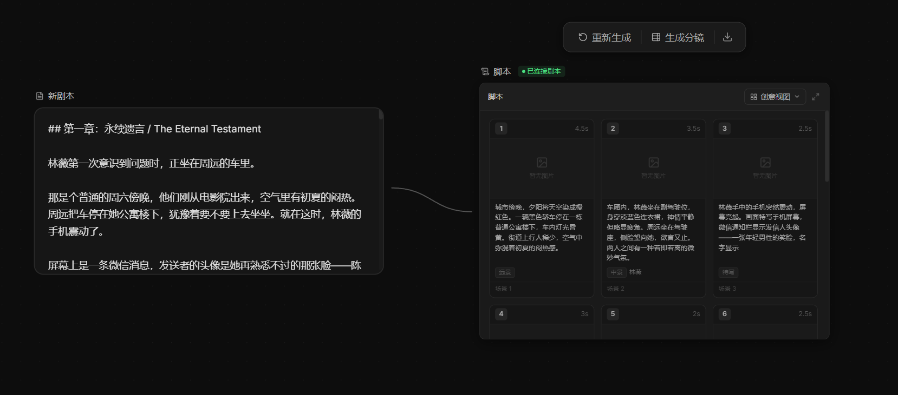

# 2026-04-21_06 ScriptGenNode 刷新后分镜数据持久化

## 背景

分镜脚本节点生成完成后，刷新页面会导致所有分镜数据（镜头列表、场景标题、节点状态）
全部丢失，节点重置回空白的 idle 模式。

---

## 根因

`shots`、`sceneTitle`、`mode` 均为纯 React 本地 state，只存活于组件内存。
后端 `workflow_config` 保存的 `nodes` 数组中，每个节点有 `config` 字段用于存储
节点业务数据，但分镜节点从未向 `config` 写入生成结果，导致刷新后无法恢复。

---

## 修复

### 1. 初始化时从 `data.config` 恢复

```ts
const persistedShots      = (data.config?.shots      ?? []) as ShotRow[]
const persistedSceneTitle = (data.config?.sceneTitle ?? '') as string
const persistedMode       = (data.config?.mode       ?? data.initialMode ?? 'idle') as Mode

const [shots, setShots]         = useState<ShotRow[]>(persistedShots)
const [sceneTitle, setSceneTitle] = useState(persistedSceneTitle)
const [mode, setMode]           = useState<Mode>(persistedMode)
```

### 2. 新增 `persistResult()` helper

```ts
const persistResult = useCallback((savedShots: ShotRow[], savedTitle: string) => {
  updateNode(data.id, {
    config: {
      ...data.config,
      shots: savedShots,
      sceneTitle: savedTitle,
      mode: 'content',
    },
  })
}, [data.id, data.config, updateNode])
```

`updateNode` 会触发 projectStore 内的 debounce 保存，将结果写入后端
`workflow_config.nodes[*].config`。

### 3. 所有完成路径均调用 `persistResult`

| 路径 | 说明 |
|------|------|
| `onDone` 成功分支 | AI 返回并解析成功 |
| `onDone` 失败分支 | 解析失败，回退 MOCK_SHOTS |
| `runMock` | AI 报错，回退 MOCK_SHOTS |

---

## 效果

刷新后节点直接恢复为 content 模式，分镜卡片完整显示，无需重新生成。



---

## 涉及文件

| 文件 | 变更类型 |
|------|---------|
| `frontend/src/components/nodes/ScriptGenNode.tsx` | fix: 生成结果持久化到 node.config，刷新后恢复 |
