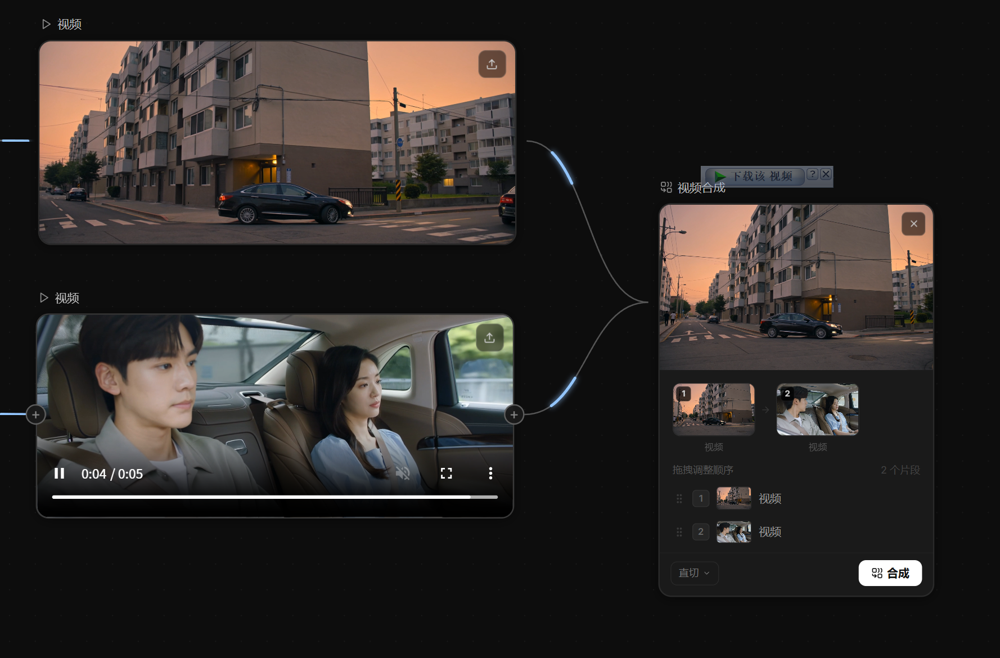

# 2026-04-24_01 VideoCompose 节点与视频持久化

## 背景

画布缺少「视频合成」能力：用户生成多段视频后，无法把它们拼接成一个完整作品。
同时 AI 生成的视频存在**第三方 CDN 外链**（Kling / Jimeng 返回的签名 URL），
**签名 ~17 分钟过期**，节点一刷新就播放失败，也无法用于后续合成。

---

## 设计目标

1. **新增 VideoCompose 节点**：支持连接多段视频，拖拽排序，一键合成
2. **视频本地持久化**：生成成功后立即把 CDN 视频拉到本地 `backend/uploads/videos/`
3. **合成引擎**：FFmpeg（concat demuxer / xfade 滤镜）
4. **兼容旧数据**：合成时若检测到 CDN 外链，自动先持久化再合成

---

## 实现

### 1. 后端新增 `video_compose.py`

`backend/app/api/v1/endpoints/video_compose.py` 提供两个端点：

**`POST /api/v1/video/compose`**

```python
class ComposeRequest(BaseModel):
    video_urls: List[str]
    transition: Literal["none", "fade", "dissolve"] = "none"
    transition_duration: float = 0.5
```

- 接受 2~20 个视频 URL（本地 `/uploads/...` 或远程 `http(s)://...`）
- 远程 URL 会用 `httpx` 流式下载到临时目录，再喂给 FFmpeg
- `none`：concat demuxer，无重编码（快，要求流参数一致）
- `fade` / `dissolve`：xfade 滤镜 + acrossfade 音频，重编码为 H.264 + AAC
- N 个片段时动态构建 filter_complex 链（`[v1][v2]xfade...[vout]`）
- 输出 `/uploads/videos/compose_<hex>.mp4`

**`POST /api/v1/video/persist`**

```python
class PersistRequest(BaseModel):
    url: str  # http(s) CDN URL
```

- 流式下载到 `backend/uploads/videos/gen_<hex>.mp4`
- 返回本地稳定 URL，取代 CDN 链接写回节点
- CDN 失败（403 签名过期等）返回 502，前端 fallback 保留原 URL 并在 log 里告警

**FFmpeg 路径解析**

`_run_ffmpeg` 优先读环境变量 `FFMPEG_BIN`，否则用 PATH 里的 `ffmpeg`。
本地环境 FFmpeg 装在 `D:\C_Softvr\ffmpeg-8.1-essentials_build\bin\ffmpeg.exe`，
通过启动时 `export FFMPEG_BIN=...` 注入。

### 2. 前端新增 `VideoComposeNode.tsx`

节点卡片布局（`NODE_W = 300`）：

- **标题栏**：Combine 图标 + "视频合成"
- **缩略图条**：横向滚动，每个片段 90×58 预览视频 + 序号角标 + 名称，片段之间用 `→` 分隔
- **可拖拽片段列表**：HTML5 native drag-and-drop（`draggable` + `onDragStart/Over/Drop/End`）
- **转场选择器**：直切 / 淡入淡出 / 叠化（底部工具栏下拉）
- **合成按钮**：`Combine` 图标，`clips.length ≥ 2` 才启用
- **输出播放器**：合成完成后显示 `<video controls autoPlay loop muted>` 和重新合成按钮

关键实现点：

```tsx
// 上游视频自动收集
const upstreamVideoNodes = allEdges
  .filter(e => e.target === data.id)
  .map(e => allNodes.find(n => n.id === e.source))
  .filter(n => n?.type === 'libtv_video' && !!(n as any).videoUrl)

// 拖拽排序
function moveClip(from: number, to: number) {
  const next = [...orderedIds]
  const [item] = next.splice(from, 1)
  next.splice(to, 0, item)
  setOrderedIds(next)
  updateNode(data.id, { sourceOrder: next })
}

// 合成前 auto-persist CDN 外链
for (let i = 0; i < clips.length; i++) {
  const c = clips[i]
  if (c.videoUrl && /^https?:\/\//i.test(c.videoUrl)) {
    setStatusMsg(`保存片段到本地 ${i + 1}/${clips.length}...`)
    const localUrl = await persistRemoteVideo(c.videoUrl)
    videoUrls.push(localUrl)
  } else {
    videoUrls.push(c.videoUrl)
  }
}
```

### 3. `VideoNode` 生成后立即持久化

```tsx
let videoUrl: string
if (selectedModel === 'kling') videoUrl = await klingGenerateVideo(opts)
else                           videoUrl = await jimengGenerateVideo(opts)

setStatusMsg('保存视频到本地...')
addLog({ level: 'info', message: '[持久化] 开始下载 CDN 视频到本地' })
const localUrl = await persistRemoteVideo(videoUrl)   // ← 立即下载到 backend/uploads/

updateNode(data.id, { videoUrl: localUrl, ... })
addLog({
  level: 'info', message: '[VideoNode] 视频生成成功',
  detail: `CDN: ${videoUrl.slice(0, 80)}...\n已保存到本地: ${localUrl}\n磁盘路径: backend\\uploads\\videos\\...`,
})
```

### 4. `AddNodePanel` 注册新节点

三处修改（避免 ID 不一致导致"点了没反应"）：

```ts
// ADD_NODE_ITEMS
{ id: 'libtv_video_compose', icon: <Scissors />, label: '视频合成', badge: 'Beta' }

// LABELS / CATEGORIES
libtv_video_compose: '视频合成'
libtv_video_compose: 'output'

// handleAddNode 白名单
if (!['libtv_script', 'libtv_script_gen', 'libtv_storyboard',
      'libtv_image',  'libtv_video',      'libtv_video_compose'].includes(typeId)) return
```

`NodeAddMenu` 的 `+` 气泡菜单也新增 `video_compose` 项（从 VideoNode 出发允许延伸到合成节点）。

### 5. Vite 代理适配僵尸端口

过程中 8000 端口出现"进程已死但 socket 未释放"的僵尸，
后端临时迁到 8002，`.env.local` 的 `VITE_API_URL` 同步更新：

```
VITE_API_URL=http://localhost:8002
```

---

## 问题与修复

### `并没有节点呢` — 点"视频合成"菜单没反应
根因：`AddNodePanel.handleAddNode` 的白名单漏了 `libtv_video_compose`，函数早 return。
修复：上面 §4 的三处同步。

### `404 Video file not found: https://mjai-...`
根因：Vite 默认代理 `/api → localhost:8000`，8000 上是**旧版后端**（没有 persist 路由，
`_resolve_path` 只认本地路径），把 CDN URL 当成本地文件找不到。
修复：
1. 后端迁到 8002
2. `.env.local` 的 `VITE_API_URL` 改成 8002
3. 硬刷浏览器让 Vite 重新读配置

### `500 FFmpeg is not installed or not on PATH`
根因：系统没装 FFmpeg。
修复：下载 [gyan.dev FFmpeg 8.1 essentials_build](https://www.gyan.dev/ffmpeg/builds/) 解压到 `D:\C_Softvr\ffmpeg-8.1-essentials_build`，后端启动时 `export FFMPEG_BIN=...\ffmpeg.exe`。

### `合成失败: 502 Source returned HTTP 403`
根因：Kling CDN URL 带签名，`q-sign-time` 只 1000 秒有效。画布上的旧视频节点签名早过期。
修复：重新生成视频；新视频会立即 persist 到本地，不再依赖 CDN。

---

## 效果



可以看到日志侧栏完整记录了：
- `[可灵] 任务已提交` / `轮询 #1 ~ #6` / `视频生成成功`
- `[VideoNode] 视频生成成功 (kling)` 带完整 CDN URL 和本地路径
- `[VideoCompose] 开始合并` 列出所有输入 URL
- `[VideoCompose] 合并完成` 输出本地 `/uploads/videos/compose_xxx.mp4`

画布上 VideoCompose 节点显示两段上游视频的缩略图，用 `→` 串成合成顺序。

---

## 变更文件

新增：
- `backend/app/api/v1/endpoints/video_compose.py` — compose + persist 端点
- `frontend/src/components/nodes/VideoComposeNode.tsx` — 节点组件

修改：
- `backend/app/api/v1/router.py` — 挂载 video_compose.router
- `frontend/src/api/index.ts` — `persistRemoteVideo()` 工具函数
- `frontend/src/components/nodes/VideoNode.tsx` — 生成后调 persist
- `frontend/src/components/canvas/AddNodePanel.tsx` — 注册 `libtv_video_compose`
- `frontend/src/components/canvas/WorkflowCanvas.tsx` — `nodeTypes` 注册
- `frontend/src/components/nodes/shared/NodeAddMenu.tsx` — `+` 菜单新增条目
- `frontend/src/types/index.ts` — `NodeData['type']` 加入 `libtv_video_compose`
- `frontend/vite.config.ts` + `frontend/.env.local` — 代理改指 8002
