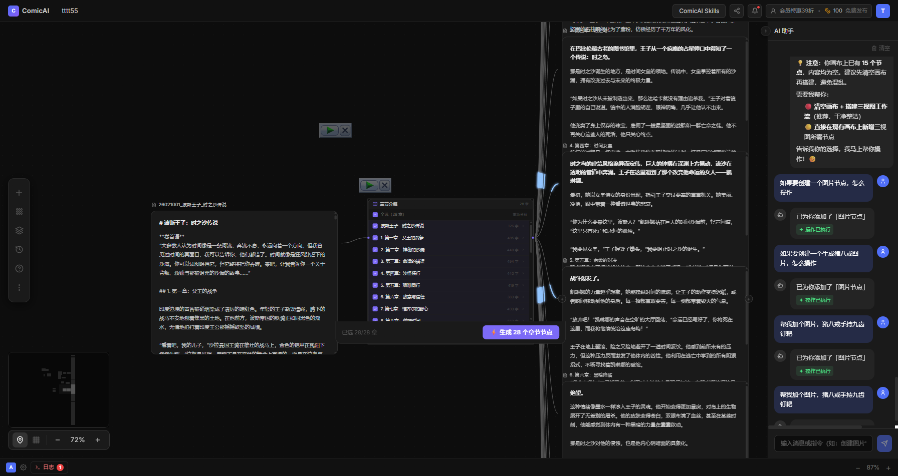

# 2026-05-17_01 小说转图片工作流实现

## 背景

用户有 Markdown 格式小说文件，需要通过节点工作流完成：
加载小说 → 按章节分解 → 每章接分镜脚本生成 → 每段生成配图。

详细设计见 `Docs/小说转图片工作流设计方案.md`。

---

## 实现内容

### Task 1：ScriptNode 支持 MD / TXT 文件导入

在 QUICK_ACTIONS 列表加「导入 MD / TXT 文件」快捷项（FolderOpen 图标）：

- 点击触发隐藏 `<input type="file" accept=".md,.txt,.markdown">`
- `FileReader.readAsText` 读取 UTF-8 内容，自动切换到 content 模式
- 文件名自动设为节点 label/title
- 超过 50 万字符自动截断 + warning 提示
- 支持重复导入同一文件（清空 input value）

**涉及文件**：`frontend/src/components/nodes/ScriptNode.tsx`

---

### Task 2：新建章节分解节点（`libtv_chapter_split`）

新建 `ChapterSplitNode.tsx`，三段式状态机：idle → splitting → done。

**分割逻辑**（两层降级）：
1. **正则优先**：识别 `# 第X章`、`第X章 标题`、`Chapter X` 等标题行，无需 AI
2. **AI fallback**：标题不规则时，调 `streamAI` 传前 8000 字符，返回 JSON 数组 `[{ title, startSnippet }]`，再用 startSnippet 在原文定位章节边界
3. **兜底**：AI 也识别不到时，整文作为单章处理

**UI 设计**：
- 章节列表：全选 checkbox + 每行章节标题 + 字数统计
- 底部「⚡生成 N 个章节节点」批量创建 `libtv_script` 节点，预填 title + content + `initialMode: 'content'`，垂直居中排列（320px 间距）
- 章节数据 `updateNode` 持久化，刷新后自动恢复
- 「重新分解」按钮随时清空重来

**注册**：WorkflowCanvas nodeTypes、AddNodePanel 菜单、types/index.ts

---

### Task 3：AI 助手 Prompt 更新

- 节点类型表加 `libtv_chapter_split`
- nodeType 白名单扩充到 7 种
- 新增小说工作流 few-shot 示例：`libtv_script → libtv_chapter_split → libtv_script_gen → libtv_image`
- dispatch 规则补充「小说/长文/章节转图片」触发条件

---

## 完整工作流

```
1. 添加 ScriptNode → 点「导入 MD / TXT 文件」导入小说
2. 添加 ChapterSplitNode → 连线 → 点「开始章节分解」
3. 勾选章节 → 点「⚡生成 N 个章节节点」
4. 每个章节节点接 ScriptGenNode → 生成分镜脚本
5. ScriptGenNode 勾选分镜 → 批量生成 ImageNode → 逐个生成配图
```

---

## 效果截图



截图说明：
- 左侧 ScriptNode 导入小说《波斯王子：时之沙传说》全文
- 中间 ChapterSplitNode 成功识别出 **28 个章节**（正则标题匹配，秒级完成）
- 章节列表默认全选，底部显示「⚡ 生成 28 个章节节点」按钮
- 右侧 AI 助手同步感知画布，主动提示下一步操作建议

---

## 涉及文件

| 文件 | 变更 |
|------|------|
| `frontend/src/components/nodes/ScriptNode.tsx` | feat: MD/TXT 文件导入 |
| `frontend/src/components/nodes/ChapterSplitNode.tsx` | 新建 |
| `frontend/src/components/canvas/WorkflowCanvas.tsx` | 注册 ChapterSplitNode |
| `frontend/src/components/canvas/AddNodePanel.tsx` | 菜单注册 |
| `frontend/src/types/index.ts` | NodeData type 扩充 |
| `backend/app/api/v1/endpoints/ai_assistant.py` | Prompt 更新 |
