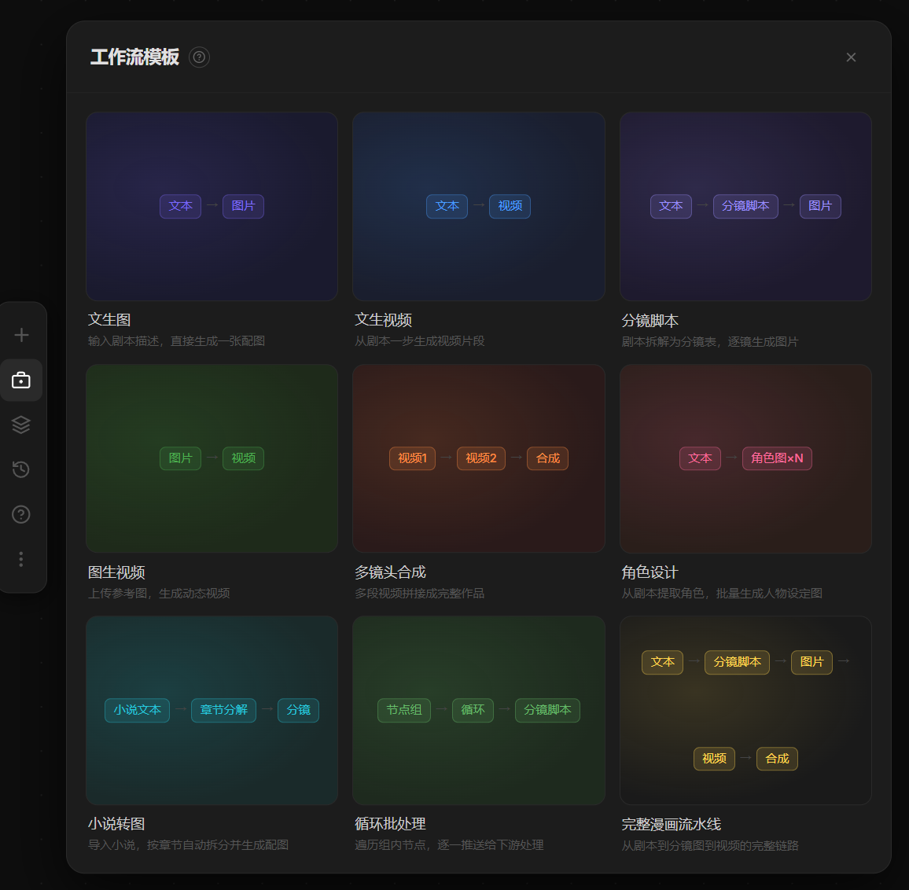

# 2026-05-19_01 工作流模板面板 + 文件拖入画布

## 背景

左侧工具箱是空占位，没有实际功能。改造为「工作流模板」面板，
让用户一键创建常用工作流，降低从零搭建的学习成本。

同时支持直接拖拽 MD/TXT 文件到画布，自动创建文本节点。

---

## 工作流模板面板

### 效果

### 9 个预设模板

| 模板 | 节点链 | 适用场景 |
|---|---|---|
| 文生图 | 文本 → 图片 | 快速生成单张配图 |
| 文生视频 | 文本 → 视频 | 一句话生成视频片段 |
| 分镜脚本 | 文本 → 分镜脚本 → 图片 | 剧本自动拆分为分镜 |
| 图生视频 | 图片 → 视频 | 参考图生成动态视频 |
| 多镜头合成 | 视频1 + 视频2 → 合成 | 多段拼接成完整作品 |
| 角色设计 | 文本 | 提取角色批量生图 |
| 小说转图 | 小说 → 章节分解 → 分镜 | 长文小说配图流水线 |
| 循环批处理 | 节点组 → 循环 → 分镜脚本 | 批量遍历章节生成内容 |
| 完整漫画流水线 | 文本 → 分镜 → 图片 → 视频 → 合成 | 从剧本到成片完整链路 |

### 实现

- `WORKFLOW_PRESETS`：每个模板定义 `nodes`（类型/标签/相对偏移）和 `edges`（连线索引对）
- `createWorkflow(preset)`：在视口中心生成所有节点 + 连线，自动关闭面板
- 卡片视觉：各模板独立 accent 颜色，节点链用彩色 tag + 箭头预览；hover 显示「一键创建」按钮

**涉及文件**：`frontend/src/pages/ProjectEditor.tsx`

---

## 文件拖入画布

在 WorkflowCanvas 上监听 `onDrop` / `onDragOver`：

- 识别 `.md` / `.txt` / `.markdown` 文件
- `project()` 将拖放的屏幕坐标转换为画布坐标
- `FileReader.readAsText` 读取 UTF-8 内容（超 50 万字截断）
- 在拖放位置创建 `libtv_script` 节点（content 模式），label = 文件名
- 同时拖入多个文件时横向排列（60px 间距）

**涉及文件**：`frontend/src/components/canvas/WorkflowCanvas.tsx`

---

## 涉及文件汇总

| 文件 | 变更 |
|------|------|
| `frontend/src/pages/ProjectEditor.tsx` | 工具箱 → 工作流模板面板 |
| `frontend/src/components/canvas/WorkflowCanvas.tsx` | 拖入文件创建文本节点 |
