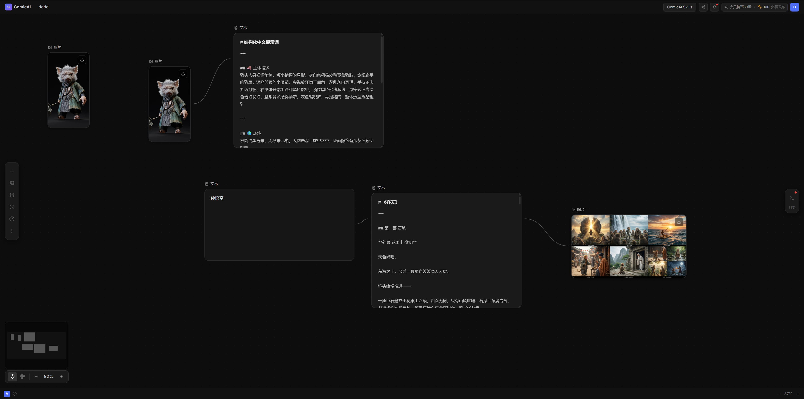

# ComicFlow AI

**输入剧本，输出完整漫剧视频** — AI 驱动的端到端漫剧创作平台

## 运行效果

### 工作流编辑器



基于 ReactFlow 的可视化节点画布，截图展示了一个以「孙悟空」为角色的创作工作流：
- 左侧两个 **图片节点** 展示角色参考图（猪头人身妖怪风格）
- 中间 **文本节点** 自动生成了结构化中文提示词（主体描述 + 环境）
- 下方 **文本节点** 接收角色名称输入，连接至剧本生成节点
- 右侧 **文本节点** 输出《齐天》分镜剧本（第一幕：石破 场景）
- 最右 **图片节点** 展示多帧 AI 生成分镜图

---

## 技术栈

| 层级 | 技术 |
|------|------|
| 前端 | React 18 + TypeScript + Vite + TailwindCSS + ReactFlow + Zustand |
| 后端 | Python FastAPI + SQLite (aiosqlite) / PostgreSQL |
| 对象存储 | 本地 `/uploads` 目录（开发）/ MinIO S3（生产） |
| AI 引擎 | OpenAI GPT-4o / DALL-E 3, Anthropic Claude, Stability AI |
| 基础设施 | Docker Compose |

## 快速开始（本地开发）

### 1. 后端

```bash
cd backend
python -m venv .venv
.venv\Scripts\activate        # Windows
pip install -r requirements.txt
uvicorn app.main:app --reload --port 8001
```

### 2. 前端

```bash
cd frontend
npm install
npm run dev                    # 访问 http://localhost:3000
```

> **注意**：前端通过 Vite 代理转发请求到后端（`/api` → `http://localhost:8001`），
> 无需配置 CORS，保持 `VITE_API_URL=` 为空即可。

### 3. 环境变量

```bash
# frontend/.env.local
VITE_API_URL=          # 留空，使用 Vite 代理
VITE_WS_URL=           # 留空，使用 Vite 代理
```

服务启动后访问：
- **前端**: http://localhost:3000
- **API 文档**: http://localhost:8001/docs
- **健康检查**: http://localhost:8001/health

## 核心功能

### 🎬 工作流编辑器
基于 ReactFlow 的可视化节点编辑器，支持拖拽连接 AI 处理节点。

**节点类型：**
- `script_input` — 剧本/角色名称输入
- `character_design` — AI 角色一致性设计（生成结构化提示词）
- `image_gen` — AI 图像生成（DALL-E 3 / Stability AI）
- `storyboard_gen` — 分镜剧本生成
- `preview` / `export` — 预览与导出

### 🖼️ 分镜板
网格/列表双视图，展示所有分镜帧，支持预览图片/视频/音频状态。

### ⏱️ 时间轴编辑器
多轨道时间轴（视频/对白/BGM/字幕），支持缩放和播放预览。

### 💾 数据持久化
- 开发环境：SQLite（`comicflow.db`）
- 生产环境：PostgreSQL + MinIO
- 迁移机制：首次登录自动将本地 IndexedDB 数据迁移至后端数据库

## API 文档

启动后访问 http://localhost:8001/docs 查看完整 OpenAPI 文档。

### 主要端点

```
POST /api/v1/auth/register    — 注册
POST /api/v1/auth/login       — 登录（返回 JWT Token）

GET  /api/v1/projects         — 项目列表
POST /api/v1/projects         — 创建项目
GET  /api/v1/projects/{id}    — 项目详情
PUT  /api/v1/projects/{id}    — 更新工作流/节点

POST /api/v1/assets/upload/{project_id}  — 上传素材
GET  /uploads/{filename}      — 访问已上传文件

WS   /ws/{project_id}         — 实时协作
```

## 项目结构

```
ComicAI/
├── backend/
│   ├── app/
│   │   ├── api/v1/endpoints/   # REST API 路由
│   │   ├── core/               # 配置、数据库、安全
│   │   ├── models/             # SQLAlchemy ORM 模型
│   │   ├── schemas/            # Pydantic 请求/响应模型
│   │   └── services/           # AI / 生成服务
│   └── comicflow.db            # SQLite 数据库（开发）
├── frontend/
│   └── src/
│       ├── components/
│       │   ├── canvas/         # 工作流/分镜/时间轴视图
│       │   ├── nodes/          # ReactFlow 自定义节点
│       │   └── panels/         # 左/右侧面板
│       ├── pages/              # Dashboard / ProjectEditor
│       ├── stores/             # Zustand 状态管理
│       ├── api/                # Axios API 客户端
│       └── types/              # TypeScript 类型定义
├── docs/
│   └── screenshots/            # 运行截图
├── docker-compose.yml
└── README.md
```

## License

MIT
